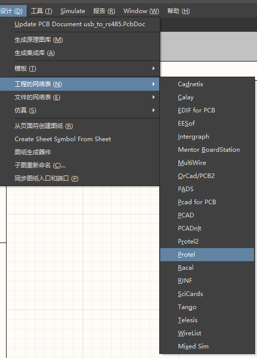
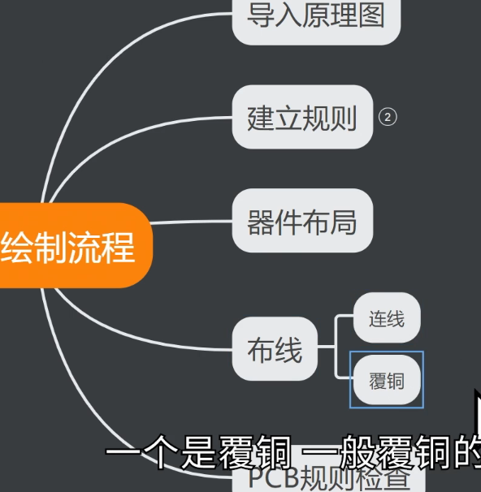

<!-- @import "[TOC]" {cmd="toc" depthFrom=1 depthTo=6 orderedList=false} -->

<!-- code_chunk_output -->
Table of Contents”（目录）
- [标题](#标题)
  - [二级](#二级)
    - [三级](#三级)
      - [四级](#四级)
        - [五级](#五级)
          - [六级](#六级)
- [文本样式](#文本样式)
  - [跳转](#跳转)
  - [斜体](#斜体)
  - [粗体+斜体](#粗体斜体)
  - [换行](#换行)
  - [删除线](#删除线)
  - [下划线](#下划线)
  - [脚注](#脚注)
  - [缩略](#缩略)
  - [标记](#标记)
- [列表](#列表)
  - [无序列表](#无序列表)
  - [有序列表](#有序列表)
  - [任务表](#任务表)
- [链接和图片](#链接和图片)
  - [链接](#链接)
  - [图片](#图片)
- [引用块](#引用块)
- [代码块](#代码块)
- [水平线](#水平线)
- [表格](#表格)
  - [上标](#上标)
  - [下标](#下标)
- [数学](#数学)
- [图像](#图像)
- [导入外部文件](#导入外部文件)
  - [命令语法总结](#命令语法总结)

<!-- /code_chunk_output -->
# 标题
## 二级
### 三级
#### 四级
##### 五级
###### 六级  

# 文本样式
## 跳转
* [斜体](#五级)
* [体](#代码块)
* [换行](#下标)
## 文本加粗 {ignore=true}
**加粗**
__加粗__
## 斜体
*斜体*
## 粗体+斜体
***粗+斜***  
## 换行
上一行末尾+两个空格  
回车换行
## 删除线
~~删除~~
## 下划线
<u>下划线</u>
## 脚注
脚注测试[^a]  
[^a]:脚注内容,要和下一行有回车，和一级标题之间也要有回车  

脚注[^c]
[^c]:6666  

Content[^3]
[^3]: kjsjmdskjdmsk  

## 缩略
*[HTML]: 666666
*[W3C]: World Wide Web Consortium
The HTML specification
is maintained by the W3C.
## 标记
==marked==

# 列表
## 无序列表  
- a
- b
- c
- d
- e    
## 有序列表
1. 数字+.+空格
2. 问问
3. 问问
## 任务表  
- [ ] 33, 减号+空格+括号
- [ ] 66, 把中括号里面的空格换成x表示已经完成
- [x] 77
- [ ] 88
- [x] 99
  
# 链接和图片
## 链接  
[百度百科](https://baike.baidu.com/),要加上http，否则会被识别成为本地文件的地址  
@import ""
[测试01，当前文件夹下的文件](/C/exercise/chapter_2/a.txt/)  /是表示当前文件夹  
[测试02](/C/exercise/2.c)  
[本地绝对路径的文件](file:///D:/code/C/exercise/chapter_2/a.txt)?**为什么不对啊, 原因，在文件绝对路径之前+file///**  
[8分钟让你快速掌握Markdown，插入https网络链接](https://www.bilibili.com/video/BV1JA411h7Gw?vd_source=8b69d23a1f786a2e7128e3e21a5bc07f)  
<iframe src="https://player.bilibili.com/player.html?isOutside=true&aid=113380308287876&bvid=BV1CE1uYDEP6&cid=26494108958&p=1" scrolling="no" border="0" frameborder="no" framespacing="0" allowfullscreen="true"></iframe>  

**插入嵌入式代码>**  

## 图片  
     
 **小括号里面只是文件名，找不到路径，除非在当前文件夹**

 **为什么不对啊, 原因，在文件绝对路径之前+file///**    
  


# 引用块
> 引用  

# 代码块
```c {highlight=1}
或者{.line-numbers}
#include<stdio.h>

int main(){
   return 0;
}
```
# 水平线
---  
___
***
# 表格

***第二行是重点，都一样的***
|姓名|年`<666>`龄|年级|  
|---|---|---|
|:张三|18|66|
|:李四|19|大二|

First Header | Second Header
------------ | -------------
Content from cell 1 | Content from cell 2
Content in the first column | Content in the second column

`<文本中插入短代码>`

## 上标  
30^th^  
40^666^
## 下标
H~2~O
6~0~2

# 数学
$f(x)=sin(x)+6$
$$f(x)=k*x+by=2*a+b$$  

# 图像
cmd 键在 Windows 中就是 ctrl

# 导入外部文件
~~@import "6.pdf"~~{page_begin=2 page_end=4}或者{page_no=1}

@import "image.png"  {width="600px" height="300px"}
- .jpeg(.jpg), .gif, .png, .apng, .svg, .bmp 文件将会直接被当作 markdown 图片被引用。
- .csv 文件将会被转换成 markdown 表格。
- .mermaid 将会被 mermaid 渲染。
- .dot 文件将会被 viz.js (graphviz) 渲染。
- .plantuml(.puml) 文件将会被 PlantUML 渲染。
- .html 将会直接被引入。
- .js 将会被引用为 <script src="你的 js 文件"></script>。
- .less 和 .css 将会被引用为 style。目前 less 只支持本地文件。.css 文件将会被引用为 <link rel="stylesheet" href="你的 css 文件">。
- .pdf 文件将会被 pdf2svg 转换为 svg 然后被引用。
- markdown 将会被分析处理然后被引用。
- 其他所有的文件都将被视为代码块。  

@import "https://raw.githubusercontent.com/shd101wyy/markdown-preview-enhanced/master/LICENSE.md"  
  
  
@import "test.py" {cmd="python3"}  
  
> wwwwwwwwwwwwwwww
> wwwwwwwwwwwwwwww  
## 命令语法总结
{width="600px" height="300px"}
{ignore=true}
{highlight=1}
{.line-numbers}
{page_begin=2 page_end=4}或者{page_no=1}
{line_begin=2 line_end=4}
@import "1.c" {line_begin=2 line_end=4}

---
export_on_save:  
html: true
---