<!-- @import "[TOC]" {cmd="toc" depthFrom=1 depthTo=6 orderedList=false} -->

<!-- code_chunk_output -->

- [PCB设计](#pcb设计)
  - [PCB结构入门](#pcb结构入门)
  - [工艺指标](#工艺指标)
  - [pcb元素](#pcb元素)
  - [pcb设计依据-原理图](#pcb设计依据-原理图)
  - [设计流程](#设计流程)
- [如何阅读芯片数据手册](#如何阅读芯片数据手册)
  - [芯片手册结构](#芯片手册结构)
  - [举例AD9945](#举例ad9945)
  - [读法](#读法)
- [PCB绘制流程，新建工程](#pcb绘制流程新建工程)
- [建库](#建库)
- [原理图](#原理图)
- [PCB图](#pcb图)

<!-- /code_chunk_output -->

# PCB设计
## PCB结构入门
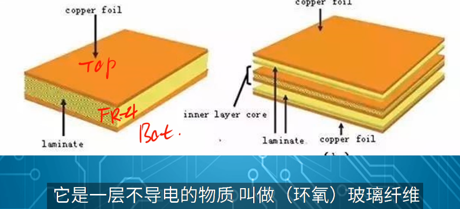
**阻焊层**
**丝印层**
 GERBER文件 光绘文件
**钻孔**
**沉铜**
**刷油**
**电测**
## 工艺指标
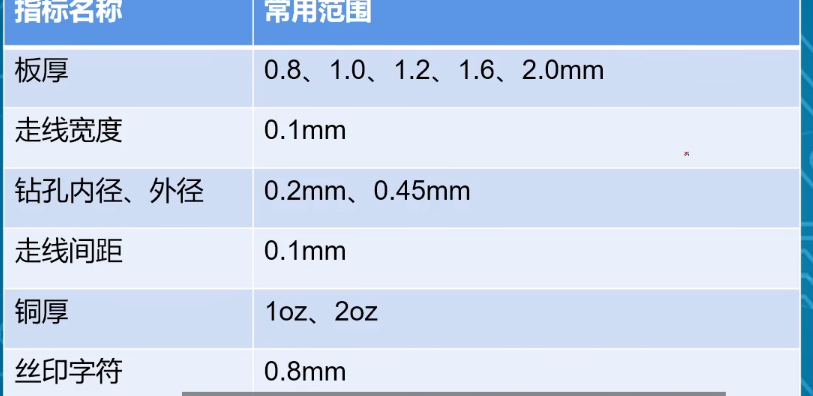
## pcb元素

1. 元件，元件库，pcblib
2. 丝印框（Pads焊盘）
3. 3d
4. 布局布线 前后板连接 信号走向
- 走线等长，差分线长度相等
5. 叠层设计
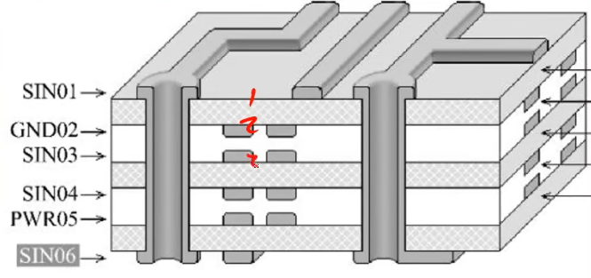
老师说6层板才需要叠层设计，四层板比两层板简单
## pcb设计依据-原理图
1. 元器件
2. 连线
3. 网名netlabel
- （注释 示意）
## 设计流程
pcbdoc 或者gerber 器件购买 焊接贴片 调试
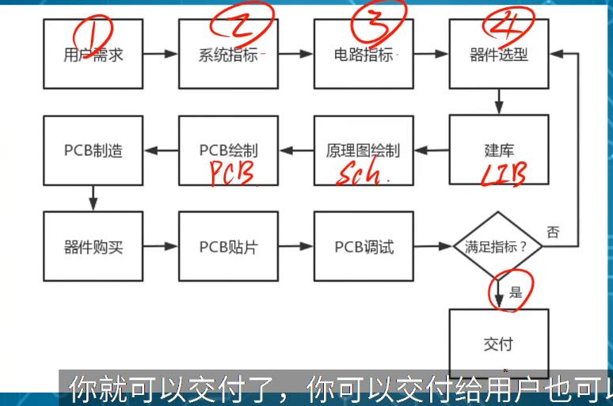
读懂用户需求.....

# 如何阅读芯片数据手册
## 芯片手册结构
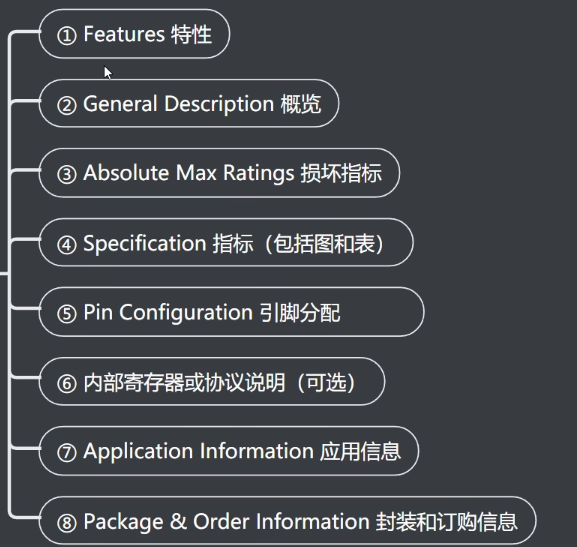

## 举例AD9945
精读general description，把每个词语都弄懂
了解指标
精读 pin function description（画好之后查一遍，再查一遍）
精读寄存器，接口协议图（SPI总线）

电路描述
器件时序
应用信息 应用电路图
outline dimensions 封装信息
ordering guide 
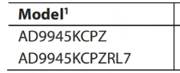
c（通常） i（工业） a（汽车）

## 读法
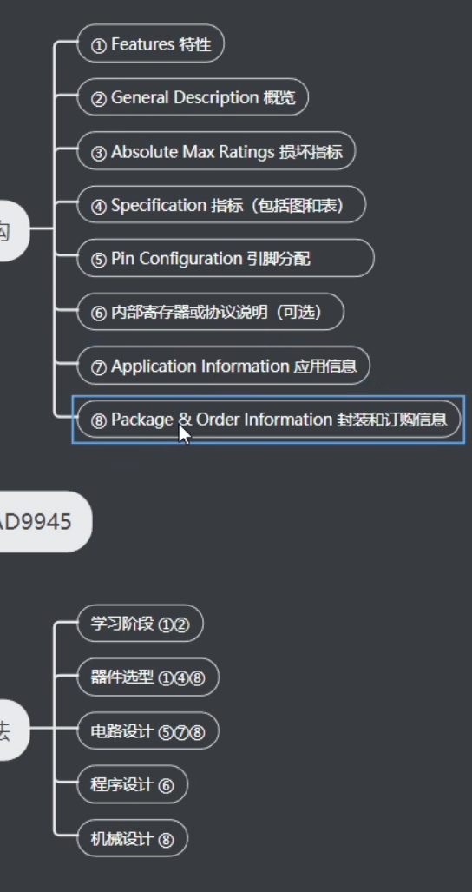

# PCB绘制流程，新建工程
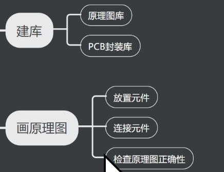
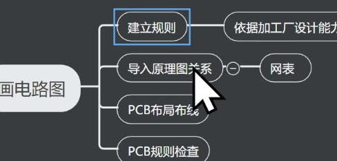

---
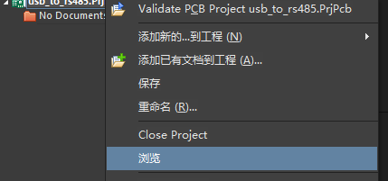
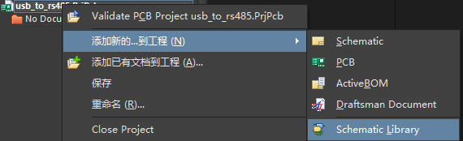
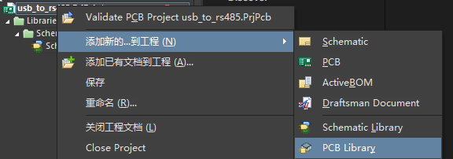
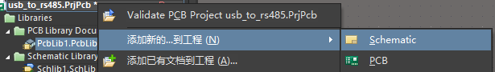

# 建库
# 原理图
# PCB图
