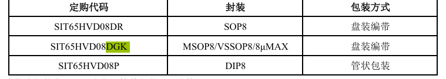

<!-- @import "[TOC]" {cmd="toc" depthFrom=1 depthTo=6 orderedList=false} -->

<!-- code_chunk_output -->

- [PCB设计](#pcb设计)
  - [PCB结构入门](#pcb结构入门)
  - [工艺指标](#工艺指标)
  - [pcb元素](#pcb元素)
  - [pcb设计依据-原理图](#pcb设计依据-原理图)
  - [设计流程](#设计流程)
- [如何阅读芯片数据手册](#如何阅读芯片数据手册)
  - [芯片手册结构](#芯片手册结构)
  - [举例AD9945](#举例ad9945)
  - [读法](#读法)
- [PCB绘制流程，新建工程](#pcb绘制流程新建工程)
- [建库](#建库)
  - [如何画pcb库](#如何画pcb库)
  - [外部导入pcb库](#外部导入pcb库)
  - [原理图库](#原理图库)
    - [建立新器件](#建立新器件)
    - [放置引脚](#放置引脚)
    - [指定封装](#指定封装)
- [原理图](#原理图)
  - [添加元器件](#添加元器件)
  - [连接元器件](#连接元器件)
  - [元器件编号](#元器件编号)
  - [检查原理图](#检查原理图)
  - [网表](#网表)
- [PCB图](#pcb图)

<!-- /code_chunk_output -->

# PCB设计
## PCB结构入门

**阻焊层** 
**丝印层**
 GERBER文件 光绘文件
**钻孔**
**沉铜**
**刷油**
**电测**
## 工艺指标

## pcb元素

1. 元件，元件库，pcblib
2. 丝印框（Pads焊盘）
3. 3d
4. 布局布线 前后板连接 信号走向
- 走线等长，差分线长度相等
5. 叠层设计

老师说6层板才需要叠层设计，四层板比两层板简单
## pcb设计依据-原理图
1. 元器件
2. 连线
3. 网名netlabel
- （注释 示意）
## 设计流程
pcbdoc 或者gerber 器件购买 焊接贴片 调试

读懂用户需求.....

# 如何阅读芯片数据手册
## 芯片手册结构

## 举例AD9945
精读general description，把每个词语都弄懂
了解指标
精读 pin function description（画好之后查一遍，再查一遍）
精读寄存器，接口协议图（SPI总线）

电路描述
器件时序
应用信息 应用电路图
outline dimensions 封装信息
ordering guide 

c（通常） i（工业） a（汽车）

## 读法

# PCB绘制流程，新建工程

---

# 建库

先建pcb库，数量少
## 如何画pcb库

pcb库 顶层 底层 机械层 丝印层
1. 顶层画pads

- ctrl+m，测量
- shift+c，清楚
- Q换单位
- G换网格长度

2. 丝印层画外框
按住ctrl再拉
3. 机械层画3d外形
数字键2，二维
数字键3，三维
shift+右键，3d视图中旋转
## 外部导入pcb库

[嘉立创](https://szlcsc.com)
以前做过的，或者在网上找的ad的pcb库可以拿来直接用，
单个导入pcbdoc的话，先打开，复制，选择以哪个引脚为基准复制，粘贴到对应文件。

确认封装库是否可用
## 原理图库
### 建立新器件

### 放置引脚
 
 - 填入元件名字，如SIT65HVD08DGK
 
1. RO，接收器输出引脚

2. /RE通常为输入引脚，它接受来自外部的信号来控制是否启用读取操作。
当/RE引脚为低电平（即0）时，芯片的读取功能被激活，允许芯片输出数据到数据总线上。
当/RE引脚为高电平（即1）时，读取功能被禁用，芯片不会输出数据。
数据输出使能

3. DE，数据输出使能
4. DI，驱动器输入
### 指定封装

# 原理图

## 添加元器件
从schlib点击 **放置** 到schdoc

- 网络标签
USB_P,
USB_N,差分线负端
- 差分线标识符

## 连接元器件

容值越小的电容，应该离管脚越近
容值越大的电容

## 元器件编号

## 检查原理图
- 只有一个引脚
- 悬空的输入端
## 网表

# PCB图
