<!-- @import "[TOC]" {cmd="toc" depthFrom=1 depthTo=6 orderedList=false} -->

<!-- code_chunk_output -->

- [Git](#git)
  - [版本控制系统vcs->git](#版本控制系统vcs-git)
    - [下载](#下载)
    - [配置](#配置)
    - [自己项目配置](#自己项目配置)
      - [提交操作](#提交操作)
      - [查看操作](#查看操作)
- [总结](#总结)
    - [注意事项 删除仓库或文件是不可逆的，因此确保在删除前备份或确认操作是否必要。](#注意事项-删除仓库或文件是不可逆的因此确保在删除前备份或确认操作是否必要)
- [github desktop](#github-desktop)
  - [在github上创建一个仓库](#在github上创建一个仓库)
  - [在desktop上clone仓库里的内容](#在desktop上clone仓库里的内容)
  - [在本地修改的文件如何发送到github](#在本地修改的文件如何发送到github)
  - [项目开发](#项目开发)
    - [分支](#分支)
    - [仓库上传](#仓库上传)

<!-- /code_chunk_output -->

# Git
## 版本控制系统vcs->git
### 下载
git-scm.com/download/win

---
### 配置
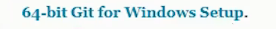{width="600px" hight="300px"}

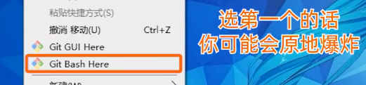{width="600px" hight="300px"}

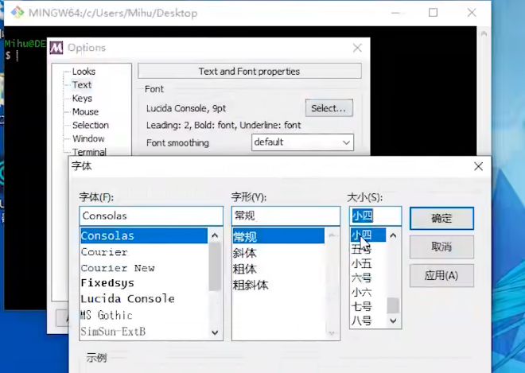{width="600px" hight="100px"}

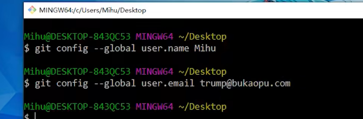{width="600px" hight="100px"}

从github上下载文件 **git clone** 

{width="600px" hight="300px"}

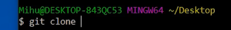{width= "600px"} 

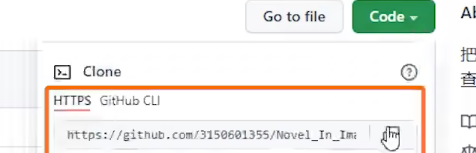{width= "600px"} 

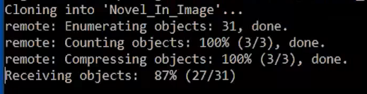{width= "600px"} 

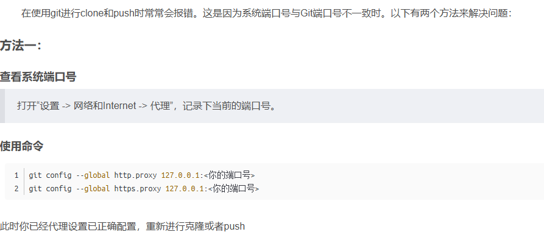{width= "600px"} 

***.git文件夹里面的东西不要动***

---
### 自己项目配置
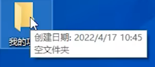{width= "600px"} 

 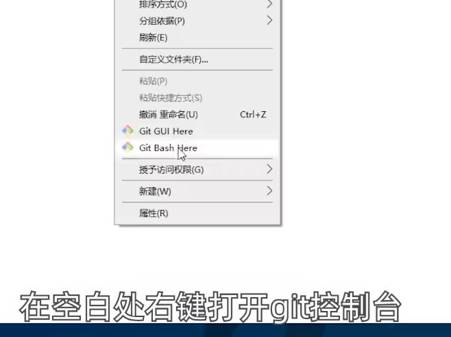{width= "600px"} 

 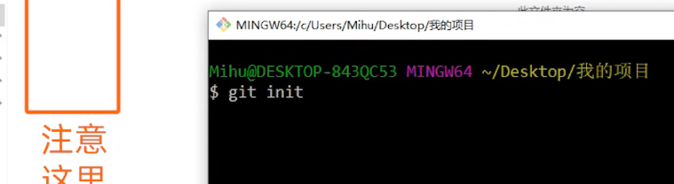{width= "600px"} 

 **git init 初始化**   生成.git文件

 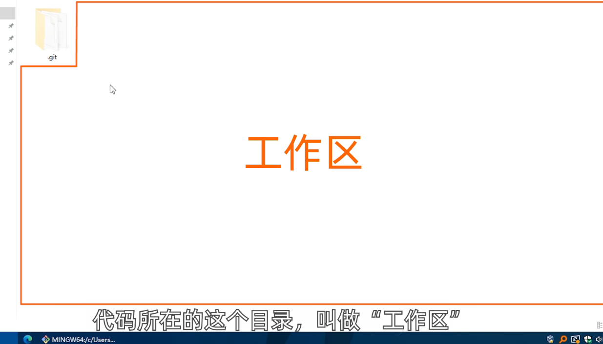{width= "600px"} 

 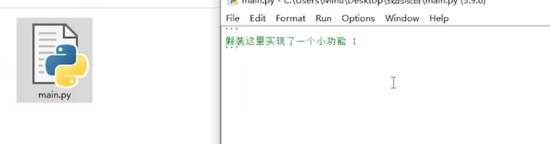{width= "600px"} 

 ---
#### 提交操作
**git add .** .的意思是当前文件夹 

{width= "600px"} 

{width= "600px"} 

**git commit -m "xxx"**

引号里的部分是对提交的备注"功能1已完成，一定要写"

{width= "600px"} 

---
#### 查看操作
**git log**查看提交历史记录

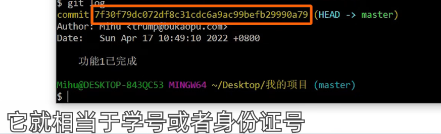{width= "600px"} 

**checkout**修复代码

git checkout HEAD main.py

{width= "600px"} 

{width= "600px"} 

针对性提交代码，比如main.py完成了，另一个代码只写了一半

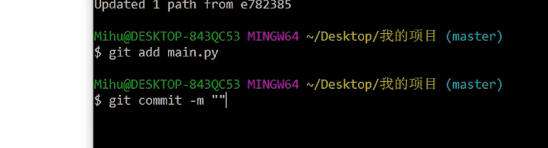{width= "600px"} 

---
# 总结
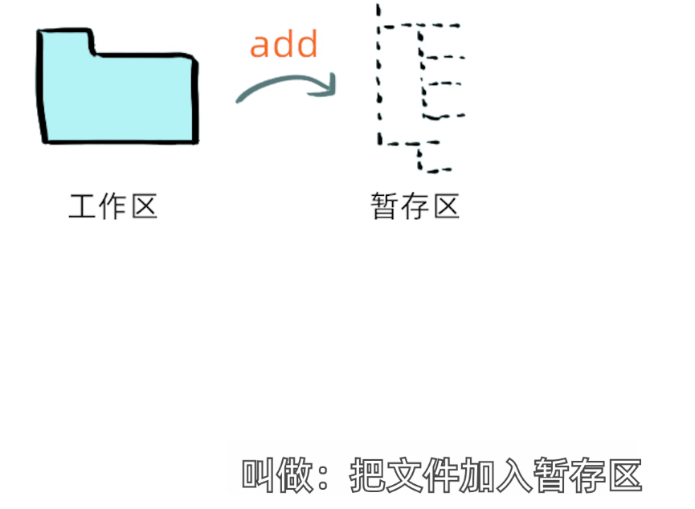{width= "600px"} 

{width= "600px"} 

有些版本控制软件，如SVN无暂存区

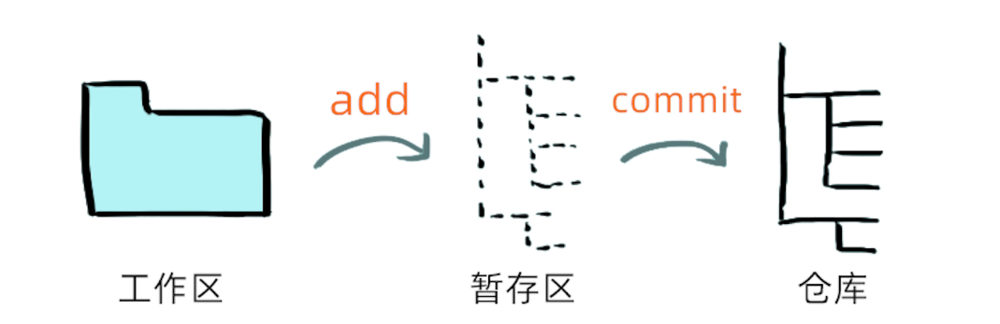{width= "600px"} 

---
### 注意事项 删除仓库或文件是不可逆的，因此确保在删除前备份或确认操作是否必要。
你可以删除复刻（Fork）到你 GitHub 仓库的内容，具体取决于你想要删除的内容：
 1. **删除复刻的整个仓库**：如果你想完全删除复刻的仓库，可以直接在 GitHub 上删除这个仓库。这会移除所有内容，包括代码、提交记录和分支。删除步骤如下： - 进入复刻的仓库页面。 - 点击右上角的 “Settings”（设置）。 - 滚动到页面底部，找到 “Danger Zone” 区域，点击 “Delete this repository”。 - GitHub 会提示你确认删除，并要求输入仓库名称来确认操作。 
2. **删除复刻仓库中的特定内容**：如果你只想删除仓库中的部分文件或内容，可以： - 打开复刻的仓库，进入你想删除的文件或文件夹。 - 在文件页面，点击 “删除” 或编辑图标并提交更改，这样就可以从仓库中移除特定内容而不删除整个仓库。 

---
***
---
# github desktop
[DESKTOP文档](https://docs.github.com/zh/desktop/adding-and-cloning-repositories/adding-a-repository-from-your-local-computer-to-github-desktop),括号应该是英文的
## 在github上创建一个仓库
---
## 在desktop上clone仓库里的内容
---
## 在本地修改的文件如何发送到github
---
第一步，发送到master

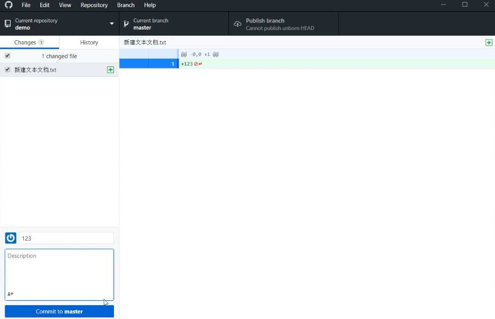{width= "600px"} 

第二步  发送到github

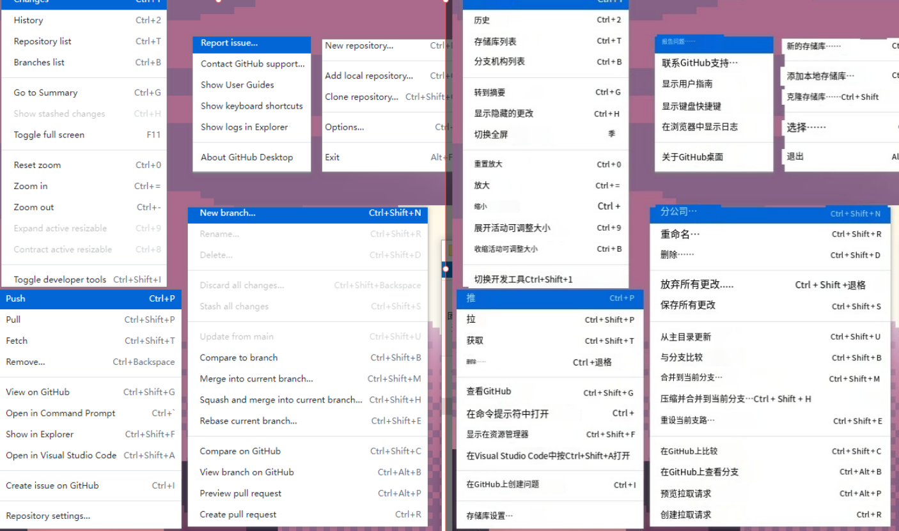{width= "900px"}
## 项目开发
---
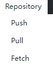
push，上传到github
pull，同步到本地
fetch， 同步
### 分支
---
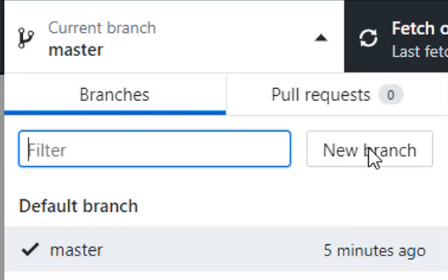{width= "600px"} 
不同人去操作的时候
### 仓库上传

---
把本地的仓库全部上传到github
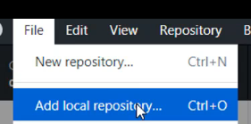{width= "600px"} 

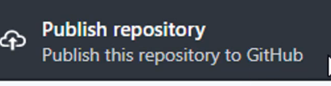{width= "600px"} 

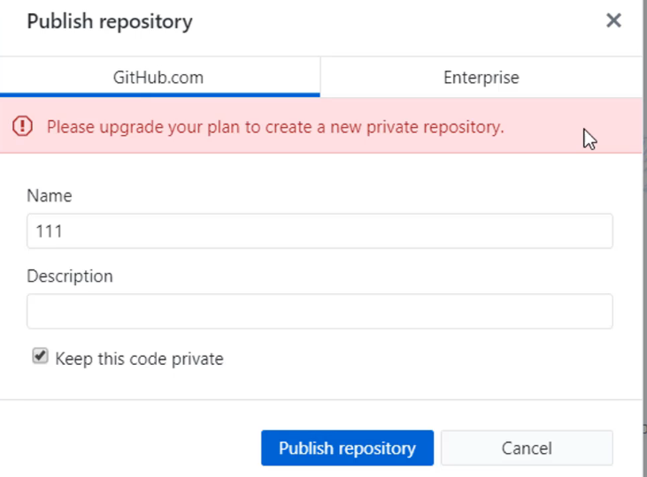{width= "600px"} 

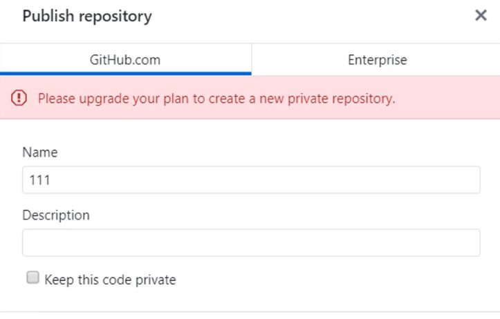{width= "600px"} 

{width= "600px"} 

