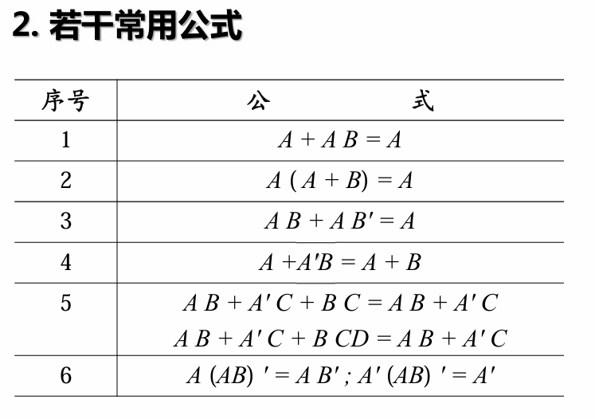

<!-- @import "[TOC]" {cmd="toc" depthFrom=1 depthTo=6 orderedList=false} -->

<!-- code_chunk_output -->

- [绪论](#绪论)
- [信息和编码](#信息和编码)
  - [取值范围要准确](#取值范围要准确)
  - [码制](#码制)
- [逻辑代数基础](#逻辑代数基础)
  - [数字电路逻辑运算](#数字电路逻辑运算)
  - [逻辑代数公式及定理](#逻辑代数公式及定理)
  - [逻辑函数及表示方法](#逻辑函数及表示方法)
  - [逻辑函数表示方法的转换](#逻辑函数表示方法的转换)
  - [逻辑函数公式化简](#逻辑函数公式化简)
  - [逻辑函数标准形式](#逻辑函数标准形式)
  - [卡诺图](#卡诺图)

<!-- /code_chunk_output -->

# 绪论
- 数字量：在时间和数量上都是离散的、不连续的
- 模拟量：数字量以外的物理量
- 电子电路 作用 处理信息、能量转换，绝大部分是处理信息
- ⾯面包板搭建中⼩小规模电路——调试工具的使⽤
- 可编程器件实现⼤规模电路——EDA⼯工具，硬件描述语⾔
- PCB板实现成熟电路——EDA⼯具, 焊接调试
# 信息和编码
1. 由补码求十进制数 

2. 最高位为符号位（0为正，1为负）
正数的补码和原码相同
负数的补码= 数值位逐位取反+1（加在最右边）
位数扩展：如5（0 0101）扩展为8位，在前面加3个0
-5（1 1011）扩展为8位，在前面加3个1
## 取值范围要准确

6位，补码表达的范围（-32到31）
## 码制

# 逻辑代数基础
## 数字电路逻辑运算
在逻辑图中，遇到not的小圈就取反

- [ ] Q1什么是逻辑图？[^1]
[^1]:6666

异或，A反B + AB反
（对的但是没有信息量哈哈）
## 逻辑代数公式及定理

反演定理在数字电路实现过程中，意义不大，因为只需要加个反就好了
## 逻辑函数及表示方法

变量个数确定，输出的可能性就确定了
根据逻辑式插面包板[^1]
[^1]: 666
## 逻辑函数表示方法的转换
看波形图是否完整，首先看他是不是够长，4个变量的话要有16个输入组合
波形图完整之后，看输出为1对应的输入值
写短的，然后取反

## 逻辑函数公式化简
- 任何逻辑函数一定是某些最小项之和

- 最大项  为0

- 5.05 41min

## 逻辑函数标准形式

## 卡诺图
