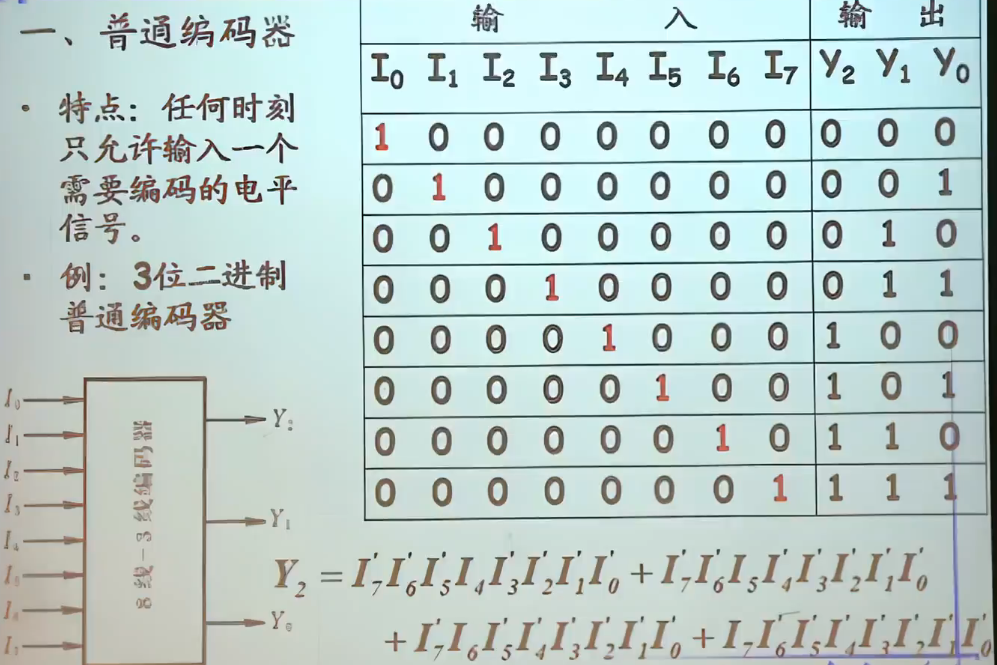
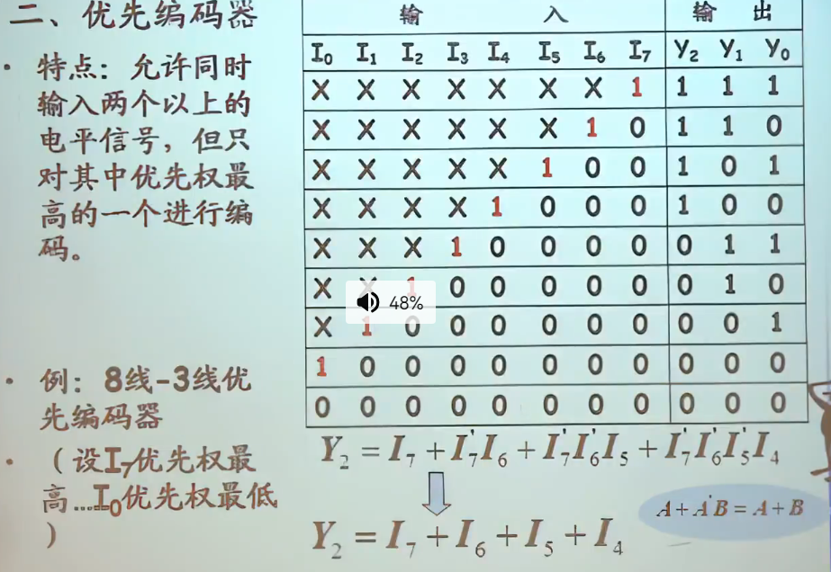
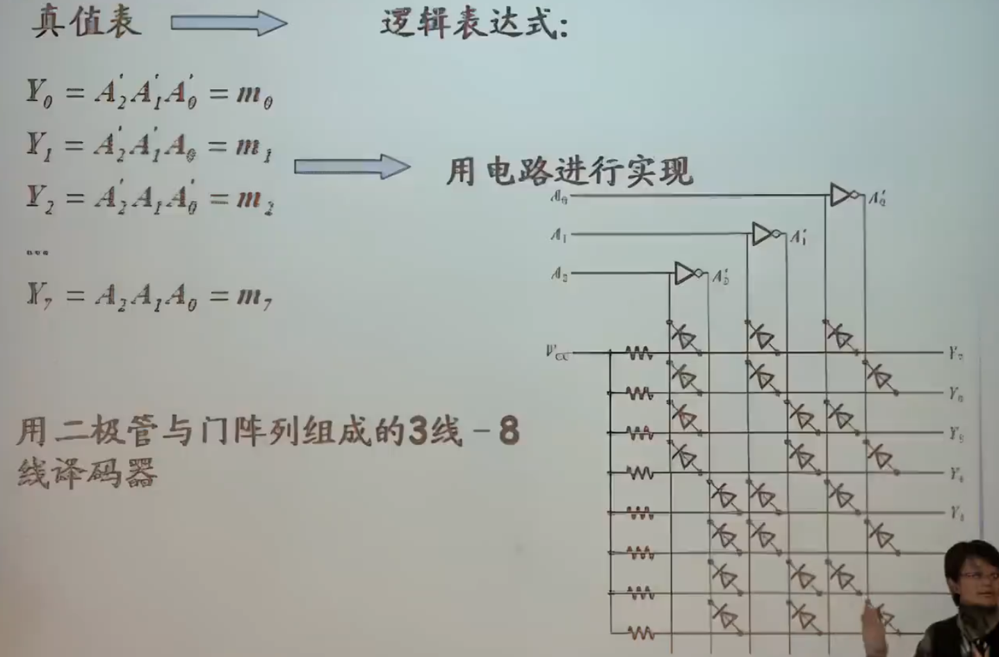
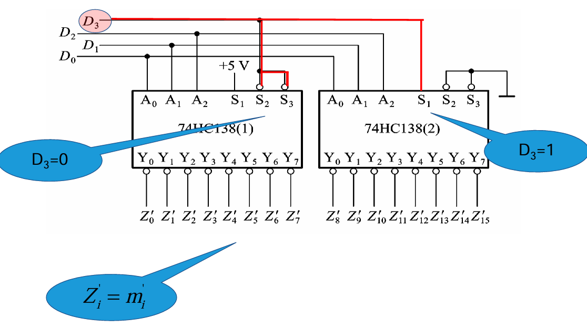
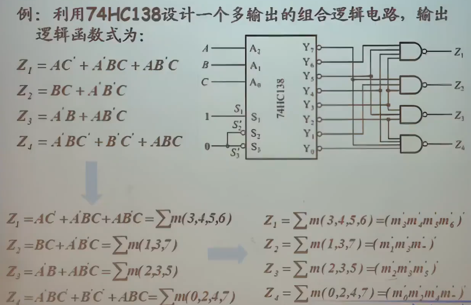
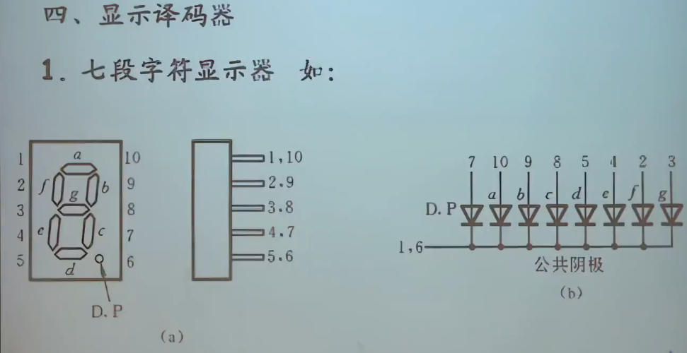

组合逻辑电路是数字电路的重要组成部分，其核心特点是输出仅与当前输入状态有关（无记忆功能）。如果想深入掌握组合逻辑电路知识，尤其是为单片机、嵌入式系统或数字系统设计服务，以下内容是必须学习的：

---

## **1. 基础内容（必须掌握）**
### **1.1 基本逻辑门电路**
- **内容：**
  - 与门（AND）、或门（OR）、非门（NOT）、异或门（XOR）、同或门（XNOR）。
  - 逻辑门的真值表、符号和功能。
- **应用：**
  - 理解单片机I/O口的数据处理逻辑。
  - 设计简单逻辑控制电路（如控制LED亮灭）。

---

### **1.2 逻辑代数与化简**
- **内容：**
  - 布尔代数基本定律：交换律、结合律、分配律、消去律、德摩根定律。
  - 卡诺图（Karnaugh Map, K-map）用于化简逻辑表达式。
  - 最小项和最大项的概念。
- **应用：**
  - 优化逻辑电路设计，减少逻辑门数量，提高效率。

---

### **1.3 典型组合电路**
- **内容：**
  - ==编码器（Encoder）==
  - ==解码器（Decoder）==
  - ==多路复用器（Multiplexer, MUX）==
  - ==数据选择器==
  - ==全加器和半加器==
- **应用：**
  - **编码器和解码器：** 用于地址译码、信号编码（如键盘扫描）。
  - **多路复用器：** 用于数据选择，节省I/O资源。
  - **加法器：** 用于算术运算，如单片机的ALU（算术逻辑单元）。

---

### **1.4 真值表与逻辑表达式**
- **内容：**
  - 真值表和逻辑表达式的相互转换。
  - SOP（与或式）和 POS（或与式）的概念。
- **应用：**
  - 根据电路功能需求生成真值表，设计具体的逻辑电路。

---

## **2. 进阶内容（推荐掌握）**
### **2.1 数码管和显示电路**
- **内容：**
  - 数码管的编码方式（七段显示的逻辑控制）。
  - 与解码器的结合应用。
- **应用：**
  - 使用单片机驱动数码管显示数字和符号。

---

### **2.2 组合电路的层次化设计**
- **内容：**
  - 复杂逻辑电路的模块化设计（分级）。
  - 使用小型单元（如解码器、MUX）搭建复杂逻辑功能。
- **应用：**
  - 提高复杂电路设计的可读性和可维护性。

---

### **2.3 组合电路中的竞争与冒险**
- **内容：**
  - 竞争与冒险现象的产生原因及消除方法。
  - 静态和动态冒险的区别。
- **应用：**
  - 确保逻辑电路的可靠性，避免误触发。

---

### **2.4 可编程逻辑器件（PLD）中的实现**
- **内容：**
  - 使用 CPLD/FPGA 实现组合逻辑电路。
  - 理解查找表（Look-Up Table, LUT）与逻辑表达式的对应关系。
- **应用：**
  - 使用 Verilog/VHDL 编写逻辑代码，用硬件语言设计组合电路。

---

### **2.5 组合逻辑电路的延迟特性**
- **内容：**
  - 门延迟的概念及其对复杂组合逻辑电路的影响。
  - 临界路径分析。
- **应用：**
  - 设计高速电路时优化延时，提高系统性能。

---

## **3. 专业内容（深入研究时掌握）**
### **3.1 算术与逻辑电路**
- **内容：**
  - 加法器、减法器的进位/借位逻辑。
  - 数字比较器。
  - 算术单元的设计（如乘法器、除法器）。
- **应用：**
  - 数学运算功能的硬件实现，例如单片机中的数学运算模块。

---

### **3.2 逻辑电路的面积与功耗优化**
- **内容：**
  - 布尔函数的多级实现（组合与时序混合设计）。
  - CMOS电路中逻辑设计的功耗分析。
- **应用：**
  - 在嵌入式系统或低功耗设备中优化电路设计。

---

## **4. 实践方法**
- **设计小实验：**
  - 使用逻辑芯片（如 74 系列）搭建加法器、解码器等电路。
  - 使用单片机模拟或连接外部组合电路（如用 GPIO 控制多路复用器）。
- **结合工具：**
  - 使用数字电路仿真软件（如 Multisim、Proteus）进行仿真实验。
  - 进阶可用 FPGA 开发板，学习用 Verilog 设计组合逻辑电路。

---

## **总结**
组合逻辑电路是数字电路的核心，以下内容优先掌握：
1. 基本逻辑门和真值表。
2. 编码器、解码器、多路复用器、加法器。
3. 卡诺图优化和逻辑化简。

进阶内容则结合项目需求逐步深入，例如可编程逻辑器件的使用、冒险问题和延迟优化。将理论与实际应用结合，会让你对组合逻辑电路的理解更为深刻。

## 组合逻辑电路
无记忆元件
## 编码器
- 将输入的每个高低电平信号变成一对二进制代码
普通编码器，优先编码器
---

---

---

外设地址管理芯片74LS138
---
- 利用附加控制端进行扩展，用74HC138译码器，（3线-8线译码器），扩展成4线-16线译码器

- **将D~3~D~2~D~1~D~0~的1000~1111这8个代码译成Z' ~8~~Z' ~15~**

学习进度[^1]
[^1]:20.20电学组合电路模块第二讲

译码器的核心思想是：

将输入变量的组合转换为所有可能的最小项输出。
利用这些最小项构造任何逻辑函数。

